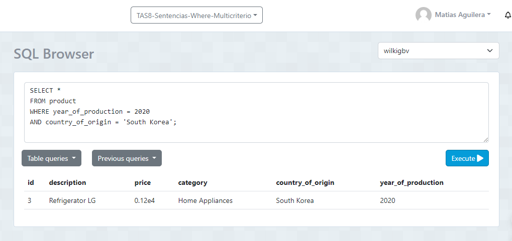

# TAS8 - Sentencias where multicriterio
## 1. Contar el número de productos de una categoría específica:

  - Sentencia:
  ```
 SELECT COUNT(*) 
FROM product 
WHERE category = 'Electronics';
  ```
- Captura:
  
 

## 2. Contar el número de clientes en una ciudad específica:


  - Sentencia:
  ```
 SELECT COUNT(*) 
FROM client 
WHERE city = 'Bilbao';
  ```
 - Captura:


## 3. Contar el número de productos cuyo precio está dentro de un rango específico:

  - Sentencia:
  ```
 SELECT COUNT(*) 
FROM product 
WHERE price BETWEEN 100 AND 1000;
  ```
- Captura:
  
 >

## 4. Seleccionar clientes que viven en una ciudad específica y tienen un tipo de cliente específico:
 - Sentencia:
  ```
SELECT * 
FROM client
WHERE city = 'Sevilla'
AND type_of_client = 'VIP';
```
- Captura: 


## 5. Seleccionar productos que pertenecen a una categoría específica y cuyo precio está por encima de un valor específico:
 - Sentencia:
  ```
SELECT *
FROM product 
WHERE category = 'Electronics'
AND price > 0.99999e3;
  ```
- Captura: 


## 6. Seleccionar productos que fueron producidos en un año específico y en un país de origen específico:
 - Sentencia:
  ```
SELECT * 
SELECT * 
FROM product 
WHERE year_of_production = 2020 
AND country_of_origin = 'South Korea';
  ```
- Captura: 



## 7.Seleccionar clientes cuyo nombre completo comience con 'J':

 - Sentencia:
  ```
SELECT * 
FROM Client
WHERE fullname LIKE 'J%';
  ```
- Captura: 


## 8.Seleccionar clientes cuya ciudad contenga la letra 'a':

 - Sentencia:
  ```
SELECT * 
FROM client 
WHERE city LIKE '%a%';
  ```
- Captura: 


 